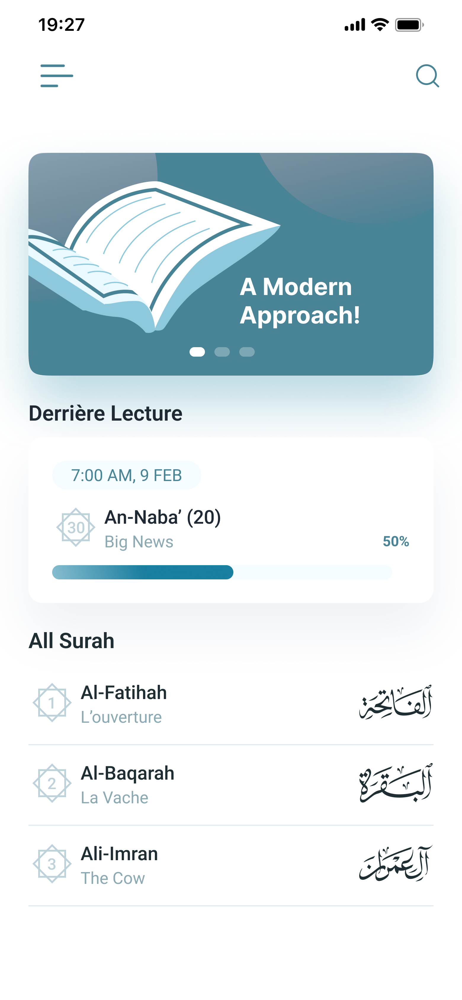
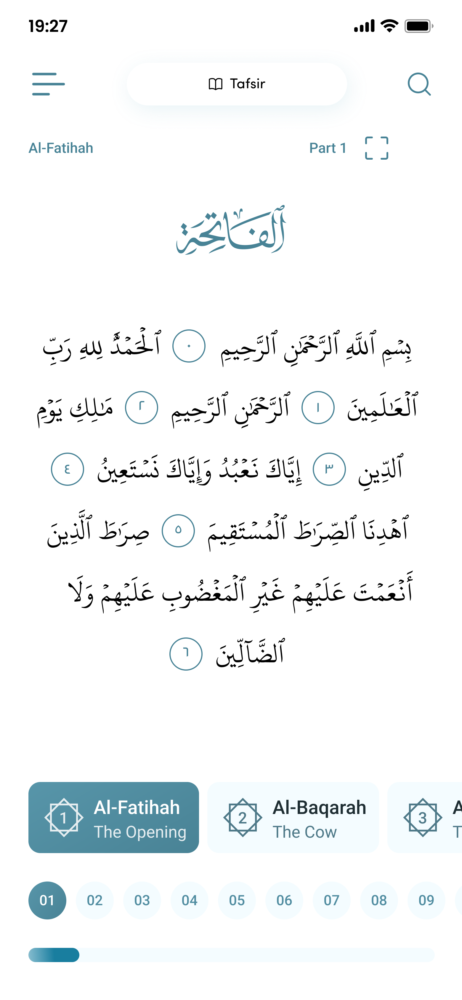

# 🕌 Quran App - Digital Islamic Reading Experience

A comprehensive Flutter mobile application providing an authentic digital Quran reading experience with advanced audio features, personalized bookmarks, and scholarly commentary (Tafsir).

> **Note:** Due to confidentiality agreements, the source code is not included.  
> This repository demonstrates the app’s features, architecture, and my personal contributions.

## 🌟 Features

### 📖 Reading Experience
- **Complete Quran Text**: All 114 Surahs with 6,236 verses across 604 pages
- **Authentic Typography**: QCF (Quran Complex Font) for traditional Arabic text rendering
- **Page-by-Page Navigation**: Seamless browsing with page numbers and surah indicators
- **Verse Highlighting**: Interactive text selection and search capabilities
- **Multi-language Support**: Arabic text with translations

### 🎵 Audio Features
- **15+ Professional Reciters**: Including renowned reciters like Minshawi, Al-Afasy, As-Sudais
- **Verse-by-Verse Playback**: Individual ayah audio with synchronized text highlighting
- **Offline Audio Caching**: Download and store audio for offline listening
- **Playback Controls**: Play, pause, seek, volume control with background playback
- **Auto-progression**: Automatic continuation to next verses

### 📚 Study & Organization Tools
- **Smart Bookmarking**: Organize verses into custom bookmark groups
- **Personal Notes**: Add and edit private notes for any verse
- **Tafsir Integration**: Comprehensive Islamic commentary for deeper understanding
- **Verse Sharing**: Share verses with customizable themes and layouts
- **Search Functionality**: Find specific verses or topics quickly

### 💾 Data Management
- **Offline First**: Full functionality without internet connection
- **Local Storage**: Efficient data persistence using Hive database
- **Smart Caching**: Optimized storage for audio files and user data
- **Cross-platform Sync**: Consistent experience across devices

## 📱 Screenshots

  
  
  

*Featuring authentic QCF font rendering, intuitive navigation, and clean Islamic design*

### Key Interface Features:
- 🏠 **Home Screen**: Clean surah listing with Arabic names and verse counts
- 📖 **Reading Interface**: Authentic Quran text with page-accurate formatting  
- 🎨 **Islamic Design**: Traditional color scheme with modern Material Design
- 📱 **Responsive Layout**: Optimized for various screen sizes and orientations

## 🏗️ High-Level Architecture

- **Frontend:** Flutter (Dart), Material Design, responsive layouts
- **State Management:** Provider pattern, reactive UI updates
- **Data Storage:** Hive (offline-first local database), JSON assets for metadata
- **Audio System:** AudioPlayers for playback, Dio for downloading and caching audio
- **Performance:** Lazy loading, optimized caching, and efficient memory management

## 👨‍💻 My Contributions
- Designed and developed the full mobile application using Flutter.
- Integrated advanced audio features with verse-by-verse playback.
- Implemented smart bookmarking, notes, and Tafsir modules.
- Optimized offline storage, audio caching, and UI performance.
- Delivered a clean, responsive, and authentic Quran reading experience.

---

  
<strong>Made with ❤️ for the Muslim community</strong>

  
<em>Bringing traditional Islamic texts to modern mobile technology</em>

